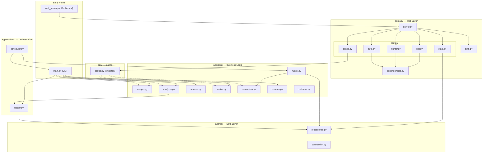

# Architecture

## System Overview

## Layer Responsibilities

| Layer | Directory | Purpose |
|-------|-----------|---------|
| **Config** | `app/config.py` | Loads `config.env` once. All modules import `settings` from here instead of calling `os.getenv()` directly. |
| **Core** | `app/core/` | Pure business logic — no web framework dependencies. Each module handles one domain (scraping, analysis, email, etc.). |
| **Data** | `app/db/` | SQLite connection management and repository pattern for clean data access. |
| **Services** | `app/services/` | Cross-cutting concerns: logging, metrics tracking, and the 24/7 scheduler. |
| **API** | `app/api/` | FastAPI routers organized by feature. Each route file is self-contained with its own state management. |

## Design Decisions

1. **Repository Pattern**: All database access goes through `ApplicationRepository` and `LeadRepository` static methods, making it easy to swap SQLite for PostgreSQL in the future.

2. **Centralized Config**: A single `Settings` class eliminates 8+ scattered `load_dotenv()` calls and provides type hints for all configuration values.

3. **Subprocess Isolation**: The bot, hunter, and scheduler run as separate Python processes (via `subprocess.Popen`), preventing any crash from taking down the web dashboard.

4. **Graceful Fallbacks**: Gemini → Groq → Base Resume. The pipeline never stops due to a single API failure.
