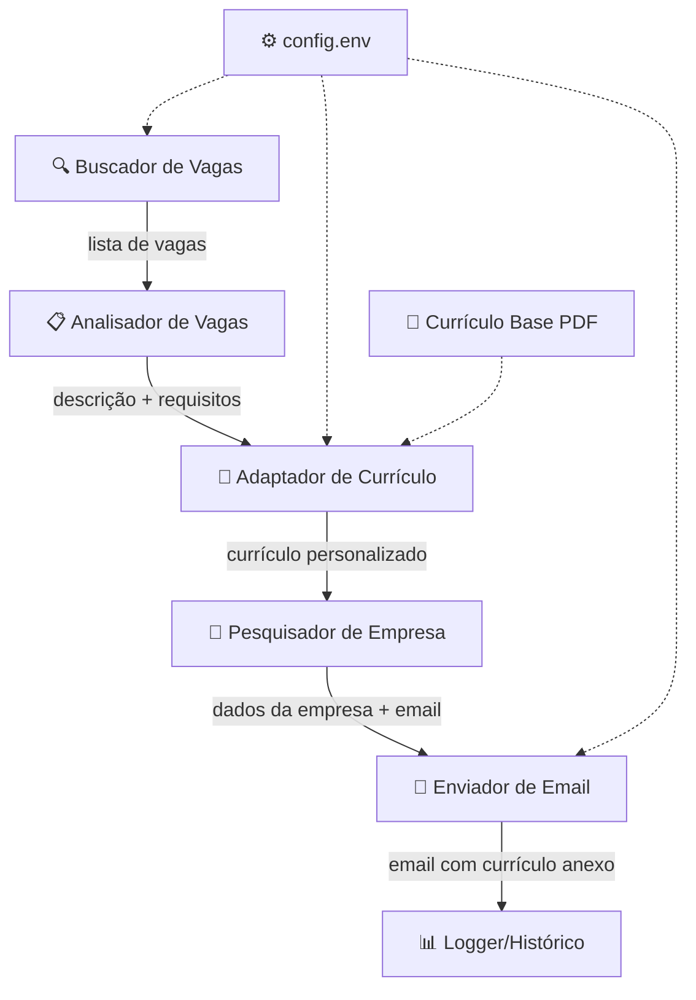

# Bot de Candidatura Automática – Plano de Implementação

Bot Python que automatiza a busca de vagas, adaptação do currículo e envio de emails de candidatura.

## User Review Required

> [!IMPORTANT]
> **Chave de API do Google Gemini (gratuita):** O bot usará a API do Google Gemini (modelo Flash, gratuito) para adaptar o currículo à vaga. Você precisará criar uma chave em [Google AI Studio](https://aistudio.google.com/). Você já tem uma?

> [!IMPORTANT]
> **Email para envio:** O bot enviará emails via Gmail usando SMTP. Você precisará:
> 1. Ativar a Verificação em Duas Etapas na sua conta Google
> 2. Gerar uma **Senha de App** (código de 16 caracteres)
> Qual email Gmail você quer usar para enviar as candidaturas?

> [!WARNING]
> **Sobre scraping de vagas:** Sites como LinkedIn, Indeed e Gupy possuem proteções anti-bot. O bot usará endpoints públicos (sem login) e respeitará rate limits, mas pode quebrar se os sites mudarem a estrutura. Para uso pessoal e baixo volume, funciona bem.

## Open Questions

1. **Seu currículo PDF (`Curriculo_Paulo_Net0.pdf`)** — o bot vai extrair o texto dele e usar como base. O currículo adaptado será gerado em formato **DOCX** (Word). Prefere que também gere em PDF?
2. **Localização das vagas** — quer focar em vagas do Brasil inteiro? Alguma cidade/estado específico? Remoto apenas?
3. **Idioma do email** — os emails de candidatura devem ser em português?
4. **Frequência de execução** — quer rodar o bot manualmente ou quer que ele rode automaticamente em intervalos (ex: 1x por dia)?

---

## Arquitetura Geral



---

## Estrutura de Arquivos

```
bot_curriculo/
├── config.env                  # Credenciais (API key, email, senha app)
├── .gitignore                  # Ignorar config.env e dados sensíveis
├── requirements.txt            # Dependências Python
├── main.py                     # Ponto de entrada / orquestrador
├── Curriculo_Paulo_Net0.pdf    # [EXISTE] Currículo base
│
├── modules/
│   ├── __init__.py
│   ├── job_scraper.py          # [NEW] Busca vagas na web
│   ├── job_analyzer.py         # [NEW] Analisa descrição da vaga
│   ├── resume_adapter.py       # [NEW] Adapta currículo com IA
│   ├── company_researcher.py   # [NEW] Pesquisa dados da empresa
│   ├── email_sender.py         # [NEW] Envia email de candidatura
│   └── logger.py               # [NEW] Registra histórico
│
├── templates/
│   └── email_template.txt      # [NEW] Template do email de candidatura
│
├── output/
│   └── (currículos adaptados gerados aqui)
│
└── data/
    └── history.json            # [NEW] Histórico de candidaturas enviadas
```

---

## Proposed Changes

### 1. Buscador de Vagas (`modules/job_scraper.py`)

Busca vagas em múltiplas fontes públicas (sem login):

| Fonte | Método | Tipo de Vaga |
|-------|--------|-------------|
| **LinkedIn Jobs (público)** | HTTP GET + parse HTML/JSON-LD | Todas |
| **Indeed Brasil** | HTTP GET + BeautifulSoup | Todas |
| **Google Jobs (via SerpAPI ou scrape)** | HTTP GET | Todas |

**Categorias de busca:**
- `desenvolvedor de software junior`
- `analista de dados junior`
- `estágio em TI`
- `suporte de TI`
- `help desk`
- `cientista de dados junior`
- `qa tester junior`

**Funcionalidades:**
- Rotação de User-Agent
- Delays aleatórios entre requisições (2-5s)
- Filtro de duplicatas por título + empresa
- Retorna lista de dicts: `{titulo, empresa, local, url, descricao}`

---

### 2. Analisador de Vagas (`modules/job_analyzer.py`)

Usa Google Gemini (Flash, gratuito) para:
- Extrair requisitos-chave da descrição
- Identificar palavras-chave e skills necessários
- Classificar nível de senioridade
- Retornar análise estruturada em JSON

---

### 3. Adaptador de Currículo (`modules/resume_adapter.py`)

**Fluxo:**
1. Extrai texto do PDF original com `PyMuPDF`
2. Envia texto do currículo + análise da vaga para o Gemini
3. Gemini retorna currículo adaptado (seções reescritas)
4. Gera novo `.docx` com `python-docx` (formatação profissional)

**Regras para a IA:**
- Manter informações verdadeiras (não inventar experiências)
- Reorganizar skills para destacar as relevantes à vaga
- Ajustar resumo/objetivo profissional para a vaga
- Manter formatação limpa e profissional

---

### 4. Pesquisador de Empresa (`modules/company_researcher.py`)

Para cada empresa que oferece vaga:
- Pesquisa no Google: `"{nome_empresa}" site contato email`
- Tenta encontrar email de RH/contato da empresa
- Se não encontrar email, registra no log e pula o envio

---

### 5. Enviador de Email (`modules/email_sender.py`)

**Configuração:** Gmail SMTP com Senha de App

**Email inclui:**
- Assunto personalizado: `"Candidatura – {Título da Vaga} – Paulo Neto"`
- Corpo baseado em template com:
  - Saudação personalizada (nome da empresa)
  - Breve apresentação
  - Por que se interessa pela vaga
  - Menção de skills relevantes
  - Currículo adaptado em anexo (.docx)
- Currículo anexado automaticamente

---

### 6. Logger/Histórico (`modules/logger.py`)

Mantém `data/history.json` com registro de todas as candidaturas:
```json
{
  "candidaturas": [
    {
      "data": "2026-04-27",
      "empresa": "Empresa X",
      "vaga": "Dev Junior",
      "url": "...",
      "email_enviado": true,
      "email_destino": "rh@empresa.com",
      "curriculo_gerado": "output/curriculo_empresa_x.docx"
    }
  ]
}
```
Evita enviar candidatura duplicada para a mesma vaga.

---

### 7. Orquestrador (`main.py`)

```python
# Fluxo principal (pseudocódigo):
1. Carregar configurações (.env)
2. Carregar histórico de candidaturas
3. Buscar vagas em todas as fontes
4. Para cada vaga não aplicada:
   a. Analisar descrição da vaga (Gemini)
   b. Adaptar currículo (Gemini + python-docx)
   c. Pesquisar email da empresa
   d. Enviar email com currículo anexo
   e. Registrar no histórico
5. Exibir resumo final
```

---

## Dependências (`requirements.txt`)

```
google-generativeai    # API Gemini (adaptar currículo)
pymupdf                # Extrair texto do PDF
python-docx            # Gerar currículo em DOCX
python-dotenv          # Carregar variáveis de ambiente
requests               # HTTP requests
beautifulsoup4         # Parse HTML
lxml                   # Parser rápido para BS4
fake-useragent         # Rotação de User-Agent
```

Todas são instaláveis via `pip` sem necessidade de `sudo`.

---

## Verification Plan

### Automated Tests
1. **Testar scraping:** Rodar o buscador de vagas e verificar se retorna resultados válidos
2. **Testar adaptação:** Gerar um currículo adaptado para uma vaga de teste e verificar output
3. **Testar email:** Enviar email de teste para o próprio email

### Manual Verification
1. Revisar a qualidade do currículo adaptado gerado pelo Gemini
2. Verificar se o email chega corretamente com o anexo
3. Rodar o fluxo completo para 2-3 vagas e validar
